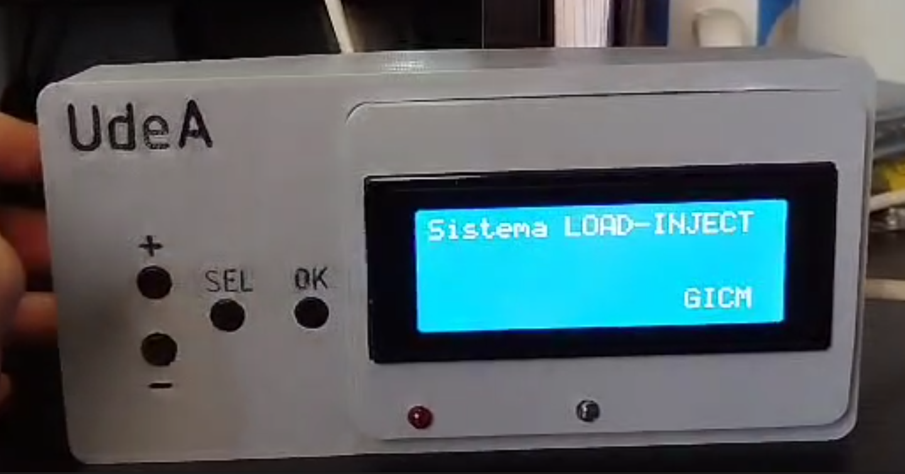

# Project README

**Authors:** Sebastian Montoya and Fabian Castaño

**Date Created:** June 17, 2023

## Project Overview

This project utilizes an ESP32 microcontroller to effectively control valves within a charging and injection system.

## System Description

The primary goal of this project is to regulate the loading and injection time within a given system. The system allows users to define their desired time intervals using buttons and initiate the process by pressing another button. Once the process starts, the loading and injection valves are precisely activated and deactivated in accordance with the configured time intervals.

## Project Structure

The project is organized into the following folders:

- `CaseDesign`: Contains design files and documentation related to the physical case or enclosure used for the system.
- `docs`: Houses any project documentation, user manuals, or related information.
- `Firmware`: This folder includes the code and firmware for the ESP32 microcontroller.
- `Hardware`: Contains hardware schematics, PCB designs, and related materials.

Feel free to explore each of these folders to access the respective project components.

For questions or assistance, please contact the authors:  
- Sebastian Montoya (sebastian.montoyah@udea.edu.co)
- Fabian Castaño (fabian.castano@udea.edu.co)

Universidad de Antioquia

